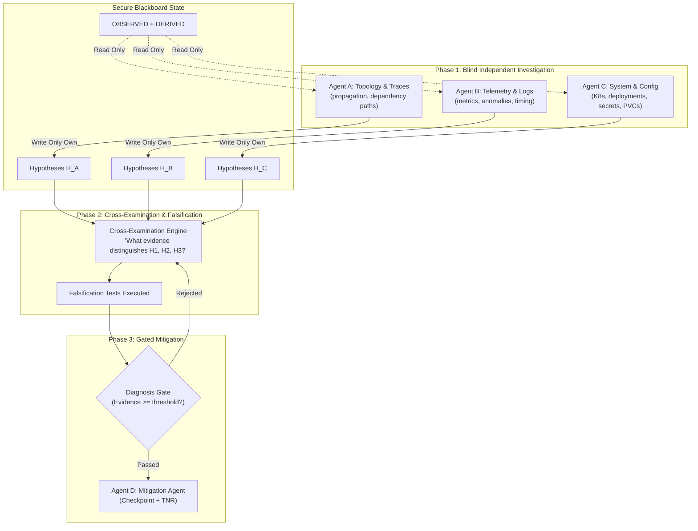
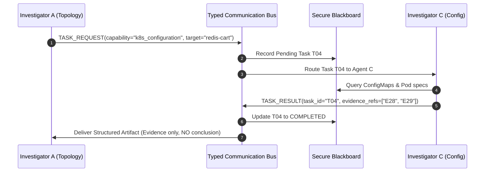
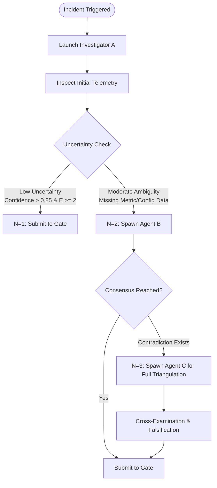
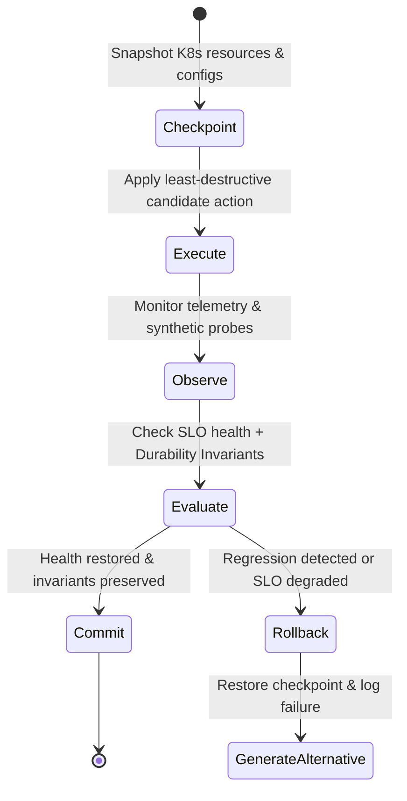
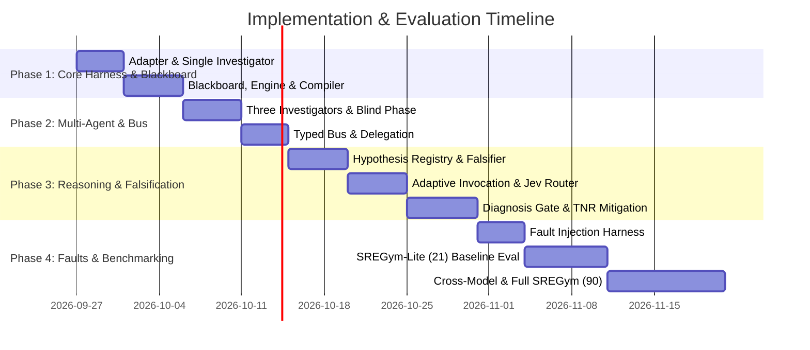

# Secure Blackboard Multi-Agent SRE

**Cloud setup and logs:** [SREGym Lite run guide](docs/SREGYM_LITE.md).
**Current evidence and limitations:** [architecture evaluation](docs/ARCHITECTURE_EVALUATION.md).
Use `scripts/run_campaign.py --sregym ../SREGym --dry-run` to check all 21 tasks for both OpenRouter model configurations without inference or deployment.
Live campaigns explicitly select the installed `blackboard-sre` agent; they do not
run any pre-existing SREGym agent. Supply the OpenRouter credential only through the
`OPENROUTER_API_KEY` environment variable as shown in the run guide.
The original quickstart and experiment runner below are offline simulations; use the live campaign runner for benchmark evaluation.

> **Title**: Reliable Multi-Agent SRE through Secure Blackboard Coordination, Evidence-Grounded Reasoning, and Adaptive Decision Routing  
> **Environment & Benchmark**: [SREGym](https://www.sregym.com/leaderboard) (SREGym-Lite: 21 faults for rapid development; Full Cohort: 90 faults for final evaluation)  
> **Framework**: Python ≥ 3.12, LangGraph (compatible with SREGym agent harness and STRATUS baseline), Pydantic v2  
> **Repository Path**: `d:\sregym aproach\secure-sre`

---

## Executive Summary & Core Identity

```text
┌────────────────────────────────────────────────────────────────────────┐
│              We are NOT building an RCA benchmark method.              │
│  We are building and testing a reliable multi-agent autonomous SRE     │
│             architecture deployed in a live environment.               │
└────────────────────────────────────────────────────────────────────────┘
```

Modern LLM-based autonomous SRE agents suffer from four catastrophic failure modes:
1. **Wrong Guess / Hypothesis Propagation**: A single agent's premature hallucination or unverified hunch corrupts all collaborating agents, leading to confirmation bias loops.
2. **Inter-Agent Communication Vulnerability**: Unstructured conversational exchanges permit persuasion over evidence, circular task delegation, dropped findings, and vulnerability to prompt injection from noisy telemetry.
3. **Foundation-Model Dependence**: Performance collapses when shifting from frontier models (e.g., Gemini 2.0 Pro / GPT-4o) to cost-effective or open models because agents rely on implicit model memory and unstructured reasoning.
4. **Token & Cost Explosion**: Calling multiple agents unconditionally on every simple incident causes quadratic token overhead without operational performance gains.

This project delivers **Secure Blackboard Multi-Agent SRE** ($M4$), establishing that **governed coordination, strict epistemic separation, evidence-grounded falsification, and bounded decision routing** can fix these vulnerabilities while operating strictly within inference budgets comparable to a single strong agent ($S0$).

---

## 1. System Architecture

```text
                           SREGym Live Incident
                                    │
                                    ▼
                       SRE MCP TOOL LAYER (MCP)
                     ┌───────────────────────────┐
                     │ Semantic Tools (1st tier) │
                     │ Raw Shell/CLI (fallback)  │
                     └─────────────┬─────────────┘
                                   │
                                   ▼
┌─────────────────────────────────────────────────────────────────────────────┐
│                              SECURE BLACKBOARD                              │
│  ┌───────────────────────┬───────────────────────┬───────────────────────┐  │
│  │ RAW / QUARANTINE      │ OBSERVED TELEMETRY    │ DERIVED FACTS         │  │
│  │ (unparsed tool output)│ (structured metrics)  │ (rule computations)   │  │
│  ├───────────────────────┼───────────────────────┼───────────────────────┤  │
│  │ HYPOTHESES (H_t)      │ VERIFIED CLAIMS       │ TASKS & ACTIONS       │  │
│  │ (competing & ranked)  │ (causally validated)  │ (typed delegation)    │  │
│  ├───────────────────────┴───────────────────────┴───────────────────────┤  │
│  │ PROVENANCE & AUDIT TRAIL (agent attribution, timestamps, signatures)   │  │
│  └───────────────────────────────────────────────────────────────────────┘  │
└──────────────────────────────────────┬──────────────────────────────────────┘
                                       │
                                       ▼
┌─────────────────────────────────────────────────────────────────────────────┐
│                           RULE / POLICY ENGINE                              │
│  • Epistemic Guard: HYPOTHESIS ≠ FACT (prevent direct writes to VERIFIED)   │
│  • Access Control: Phase-locked read/write permissions per agent role       │
│  • Deterministic Freshness: Expiration of stale telemetry                   │
│  • Delegation Limits: Max depth check to block circular loops               │
│  • Budget Enforcer: Hard limits on tokens, tool calls, and agent calls      │
│  • Prompt Generation: Compiles fresh state views (no conversation history)  │
└──────────────────────────────────────┬──────────────────────────────────────┘
                                       │
                                       ▼
┌─────────────────────────────────────────────────────────────────────────────┐
│                           JEV DECISION ROUTER                               │
│  • Diagnostic test ranking: Utility(q) = ΔHypotheses / Cost(q)              │
│  • Adaptive agent invocation: N = f(incident uncertainty)                   │
│  • Evidence ranking & continue/stop gating                                  │
│  • Model tier routing (escalate only on high uncertainty)                   │
└──────────────────────────────────────┬──────────────────────────────────────┘
                                       │
                                       ▼
┌─────────────────────────────────────────────────────────────────────────────┐
│                         AGENT COMMUNICATION BUS                             │
│       Typed Messages: TASK_REQUEST, TASK_RESULT, EVIDENCE_FOUND,            │
│                 HYPOTHESIS_CREATED, HYPOTHESIS_CHALLENGED                   │
│         ┌────────────────────────────┼────────────────────────────┐         │
│         ▼                            ▼                            ▼         │
│  Investigator A               Investigator B               Investigator C   │
│ (Topology / Traces)          (Logs / Metrics)           (Config / System)   │
└──────────────────────────────────────┬──────────────────────────────────────┘
                                       │
                                       ▼
                        HYPOTHESIS REGISTRY & MANAGER
                                       │
                                       ▼
                        FALSIFICATION ENGINE & TESTS
                         ("What would make H false?")
                                       │
                                       ▼
                        ACTIVE INVESTIGATION LOOP ↺
                                       │
                                       ▼
                             DIAGNOSIS GATE
                    (Root cause + Mechanism + Evidence)
                                       │
                                       ▼
                           AGENT D: MITIGATION AGENT
                         (Unlocked only in post-gate)
                                       │
                                       ▼
                        ACTION SAFETY & TNR ENGINE
                  (Checkpoint → Apply → Observe → Commit/Undo)
                                       │
                                       ▼
                           SREGym Verifier & Evaluator
```

---

## 2. Core Agent Roles & Workflow

We do not spawn arbitrary swarms of agents. The system utilizes **three independent diagnostic investigators** and **one post-gate mitigation agent**:



### Investigator Specifications

| Agent | Focus & Scope | Diagnostic Questions / Capabilities |
|---|---|---|
| **Agent A — Topology & Traces** | Service graph, trace spans, request propagation | Where does latency first appear? Which dependency path is broken? Is there an upstream/downstream causal cascade? |
| **Agent B — Telemetry Investigator** | Logs, Prometheus metrics, resource saturation | What telemetry changed at incident onset? Which anomalies are causal vs. secondary symptoms? |
| **Agent C — System & Config** | Kubernetes objects, Pods, ConfigMaps, Secrets, PVCs, Nodes | Are there selector mismatches, OOMKills, image pull errors, missing volume mounts, or bad network policies? |
| **Agent D — Mitigation Agent** | Safe recovery, invariant preservation | Only activates after Diagnosis Gate. Operates in TNR transactional loop (Checkpoint $\rightarrow$ Action $\rightarrow$ Verify $\rightarrow$ Commit / Undo). |

### Phase 1: Blind Investigation Phase
- **Invariance**: Agent A cannot see Agent B's hypotheses; Agent B cannot see Agent C's; Agent C cannot see Agent A's.
- **Allowed Read Surface**: `OBSERVED` telemetry and `DERIVED` facts only.
- **Why this matters**: Completely eliminates **wrong-guess propagation**. If Agent A hallucinates "memory leak", Agents B and C will not be anchored to searching for memory clues.

### Phase 2: Cross-Examination Phase
- After independent hypotheses are recorded ($H_1, H_2, H_3$), they are published to the shared hypothesis registry with supporting and contradictory evidence.
- Agents are **never** asked: *"Which agent do you agree with?"*
- Agents are prompted: *"What diagnostic observation would falsify $H_1$ or differentiate $H_1$ from $H_2$?"*

---

## 3. Secure Blackboard: Partitions & Invariants

The blackboard is not an untyped dictionary or a conversational transcript. It enforces a strict mathematical relation:

$$\boxed{\text{HYPOTHESIS} \neq \text{FACT}}$$

```text
┌─────────────────────────────────────────────────────────────────────────────┐
│                            BLACKBOARD PARTITIONS                            │
├───────────────────┬─────────────────────────────────────────────────────────┤
│ Partition         │ Description & Access Rules                              │
├───────────────────┼─────────────────────────────────────────────────────────┤
│ RAW / QUARANTINE  │ Raw, unparsed output from CLI/tools. Quarantined to      │
│                   │ prevent prompt-injection attacks from malicious logs.   │
├───────────────────┼─────────────────────────────────────────────────────────┤
│ OBSERVED          │ Raw telemetry parsed into structured objects (metrics,  │
│                   │ log entries, trace spans). Immutable once written.      │
├───────────────────┼─────────────────────────────────────────────────────────┤
│ DERIVED           │ Deterministic computations (e.g., metric anomaly > 3σ,  │
│                   │ graph shortest path). Computed by code, not LLM.        │
├───────────────────┼─────────────────────────────────────────────────────────┤
│ HYPOTHESES        │ Unverified causal claims generated by investigators.     │
│                   │ Contains: cause, mechanism, support, contradictions.    │
├───────────────────┼─────────────────────────────────────────────────────────┤
│ VERIFIED          │ Hypotheses that passed causal verification & tests.      │
│                   │ Investigators CANNOT write to this partition directly.  │
├───────────────────┼─────────────────────────────────────────────────────────┤
│ TASKS             │ Structured task delegation queue across agents.         │
├───────────────────┼─────────────────────────────────────────────────────────┤
│ ACTIONS           │ Mitigation actions (quarantined during diagnosis phase).│
├───────────────────┼─────────────────────────────────────────────────────────┤
│ PROVENANCE        │ Tamper-evident ledger of all edits, agents, and clocks. │
└───────────────────┴─────────────────────────────────────────────────────────┘
```

### Deterministic Rule Engine Enforcement

The Rule / Policy Engine is implemented in **pure Python** (zero LLM calls). This guarantees behavioral consistency regardless of the underlying LLM:

```python
# Deterministic Invariant Enforcement Rules
if current_phase == "diagnosis" and patch.proposed_actions:
    raise SecurityPolicyViolation("Destructive actions denied during diagnosis phase.")

if agent_role != "verifier" and patch.verified_claims:
    raise EpistemicPolicyViolation("Agents cannot self-promote hypotheses to VERIFIED.")

if task.delegation_depth > MAX_DELEGATION_DEPTH:
    raise DelegationRecursionError("Delegation depth limit exceeded. Circular loop prevented.")

if observation.is_stale(current_time, ttl=timedelta(minutes=5)):
    observation.mark_stale()
```

### Rule-Generated Prompts (Model Independence Engine)

Agents do not retain conversation history. On each turn, the Prompt Compiler builds a self-contained prompt:

$$\text{Prompt} = \text{Role} + \text{Task} + \text{Rules} + \text{BlackboardView} + \text{AvailableTools}$$

```text
## ROLE: Telemetry Investigator (Agent B)
## OBJECTIVE: Evaluate telemetry anomalies and generate independent hypotheses.
## CONSTRAINTS:
  - All claims must cite valid evidence IDs (e.g., E14, E21).
  - Do not use or cite any other agent's hypothesis.
  - Read-only operations only.
  - For every hypothesis, you MUST specify a falsification condition.
## AVAILABLE BLACKBOARD STATE:
  [OBSERVED]: E14 (checkoutservice HTTP 500 spike @ 14:02:10), E17 (CPU 20% normal)
  [DERIVED]:  D03 (error spike coincided with deployment rollouts)
## AVAILABLE TOOLS:
  [query_metrics, query_logs, inspect_resource_pressure]
```

---

## 4. Typed Communication Bus & Inter-Agent Delegation

Agents never send free-form conversational messages to each other. Communication is mediated by the **Typed Communication Bus** using Pydantic schemas:



### Communication Invariant: Evidence, Not Rhetoric
- **Forbidden**: Agent A $\rightarrow$ Agent B: *"Redis is definitely failing, you should check auth."*
- **Required**: Agent A $\rightarrow$ Blackboard:
  ```json
  {
    "id": "H4",
    "claim": "Redis authentication mismatch",
    "mechanism": "AUTH command rejected on cartservice connection pool",
    "supporting_evidence": ["E14", "E19"],
    "contradictory_evidence": ["E27"],
    "untested_predictions": ["Direct auth ping should return ERR"]
  }
  ```

---

## 5. Bounded Jev Decision Routing

Based on empirical findings where decision routers boost attempt success but stall when bad candidates dominate, Jev's placement is strictly bounded:

$$\boxed{\text{Rules} \longrightarrow \text{Jev} \longrightarrow \text{LLM}}$$

```text
┌────────────────────────────────────────────────────────────────────────┐
│  Rules: Handle deterministic invariants, permissions, security gates   │
│  Jev:   Handles bounded discrete ranking, routing, and stopping checks │
│  LLM:   Handles open-ended synthesis, hypothesis creation, code repair │
└────────────────────────────────────────────────────────────────────────┘
```

### Exact Jev Responsibilities
1. **Diagnostic Test Ranking**: Ranks candidate diagnostic checks using Information Gain over Cost.
2. **Adaptive Agent Routing**: Determines whether $N=1, 2,$ or $3$ agents are required based on incident ambiguity.
3. **Model Tier Routing**: Dispatches simple sub-tasks to faster/cheaper models (e.g., Gemini 2.0 Flash) and reserves frontier models for root-cause synthesis.
4. **Continue / Stop Gating**: Decides whether sufficient discriminating evidence exists to trigger diagnosis submission.
5. **No Candidate Generation**: Jev is **never** asked to hallucinate root causes—only to rank bounded alternatives.

### Hypothesis Expansion Trigger
If the top hypothesis score falls below a threshold:

$$\max_{i} \text{Score}(H_i) < \tau \implies \boxed{\text{GENERATE NEW HYPOTHESES}}$$

This prevents the system from endlessly ranking an unviable candidate set.

---

## 6. Adaptive Agent Invocation ($N = f(\text{Uncertainty})$)

To prevent multi-agent token explosion, we do not launch all investigators simultaneously on trivial incidents:



---

## 7. Active Diagnostic Test Selection & Falsification

For every serious hypothesis $H_k$, the system demands:

$$\boxed{\text{What specific observation would disprove this hypothesis?}}$$

### Test Selection Utility Function

For V1, the diagnostic utility of candidate test $q$ is formalized as:

$$\text{Utility}(q) = \frac{\#\ \text{hypotheses differentiated by test } q}{\text{estimated token} + \text{tool execution} + \text{latency cost of } q}$$

```python
# Example: Network policy vs. Pod crash
# H1: Network policy blocking traffic to port 6379
# H2: Redis pod in CrashLoopBackOff

# Discriminating test q: `kubectl get pod -l app=redis`
# If pod is Running: H2 is immediately FALSIFIED.
# If pod is CrashLoop: H1 is rendered redundant.
```

---

## 8. Diagnosis Gate & Safe Mitigation (TNR)

### The Diagnosis Gate
Before SREGym diagnosis submission, the gate requires:
1. Candidate Root Cause Component & Failure Mode.
2. Verified Causal Mechanism (propagation path verified against service graph).
3. Supporting Evidence IDs ($\ge 2$ independent sources).
4. Contradiction Check (all contradictory evidence tested or explained).
5. Current Failure Telemetry (demonstrating ongoing impact).

### Mitigation Phase & Invariant Durability
Once diagnosis is accepted, `READ_ONLY` mode is lifted **exclusively** for Agent D (Mitigation Agent).

> [!WARNING]
> Restoring immediate service health is insufficient. Mitigations must preserve **durability invariants** (e.g., config changes must survive pod restarts, deployments must remain compatible with rollouts).

### Test-and-Rollback (TNR) Workflow



---

## 9. Experimental Design & Benchmark Matrix

### SREGym-Only Benchmark Suite
- **Development & Rapid Iteration**: **SREGym-Lite** (21 faults spanning microservice, OS, network, and configuration failures).
- **Final Evaluation**: **Full SREGym** (90 faults, including retry storms, kubelet crashes, latent-sector errors, silent data corruption, and correlated failures).

### Core Baselines

| ID | Architecture Name | Coordination & Memory | Falsification | Jev / Routing |
|---|---|---|---|---|
| **$S0$** | Strong Single SRE Agent | Conversation history (STRATUS-style) | No | No |
| **$M0$** | Free-Communication MAS | Unstructured agent-to-agent chat | No | No |
| **$M1$** | Plain Shared Blackboard | Open shared dictionary / board | No | No |
| **$M2$** | Secure Blackboard + Rules | Governed partitions + Epistemic rules | No | No |
| **$M3$** | Governed Blackboard + Falsification | Governed partitions + Cross-examination | Yes | No |
| **$M4$** | **Our Proposed Full System** | Secure Blackboard + Falsification + Rules | Yes | **Yes (Adaptive + Bounded)** |

### Primary Comparisons & Hypotheses

$$\boxed{M4 > M0} \quad \text{(Core claim: Governed blackboard cures conventional MAS failure modes)}$$

$$\boxed{M4 \ge S0 \text{ at equal token budget}} \quad \text{(Demonstrates MAS collaboration justifies multi-agent complexity)}$$

$$\boxed{\text{ModelGap}(M4) < \text{ModelGap}(M0)} \quad \text{(Proves external state and rules insulate against weak LLMs)}$$

### Controlled Communication-Fault Injection

To validate resilience against communication vulnerabilities, we inject 10 specific faults into $M0$ vs. $M4$:
1. `wrong_hypothesis`: Injected high-confidence false claim from upstream agent.
2. `stale_finding`: Expired telemetry presented as active.
3. `dropped_task`: Simulated packet/message loss on inter-agent bus.
4. `duplicate_task`: Idempotency stress test with replicated requests.
5. `delayed_response`: Simulated slow agent / straggler.
6. `invalid_schema`: Malformed payload injection.
7. `agent_timeout`: Complete unresponsiveness of a specialist.
8. `prompt_injected_telemetry`: Malicious string in pod logs trying to hijack agent.
9. `circular_delegation`: Agent A calls Agent B which calls Agent A.
10. `unauthorized_action`: Diagnostic agent attempting to issue `kubectl delete`.

### Measured Evaluation Metrics

| Metric Category | Metrics | Formula / Description |
|---|---|---|
| **SREGym Operational** | Diagnosis Accuracy, Mitigation Success, End-to-End (E2E) Success | Native SREGym evaluation scores |
| **Operational Speed** | TTD (Time-to-Diagnosis), TTM (Time-to-Mitigation) | Latency in minutes from injection to resolution |
| **Inference Efficiency** | Total Tokens, Execution Cost ($), Tool Calls, Agent Invocations | Tracked across equal-budget and unrestricted runs |
| **Multi-Agent Reliability** | Error Propagation Radius ($\text{EPR}$) | $\frac{\text{Downstream components corrupted}}{\text{Total reachable components}}$ |
| | Recovery Rate ($\text{RR}$) | $\frac{\text{Corrupted runs that self-correct}}{\text{Total corrupted runs}}$ |
| | Communication Overhead ($\text{CO}$) | $\text{Tokens}_{\text{comm}} + \text{Message count} + \text{Bus latency}$ |
| | Delegation Success ($\text{DS}$) | $\frac{\text{Successfully completed delegated tasks}}{\text{Total delegated tasks}}$ |
| **Model Robustness** | Model Gap ($\text{ModelGap}$) | $\text{Perf}(M4, \text{Frontier}) - \text{Perf}(M4, \text{Weak})$ |

---

## 10. Strict 12-Step Implementation Roadmap

```text
[Step 1] SREGym Adapter & Single Investigator Driver
   │
[Step 2] Structured Secure Blackboard (Partitions & Schemas)
   │
[Step 3] Deterministic Policy Engine & Prompt Compiler
   │
[Step 4] Three Independent Investigators (Topology, Telemetry, Config)
   │
[Step 5] Typed Communication Bus & Delegation Protocol
   │
[Step 6] Hypothesis Registry, Falsification & Expansion Logic
   │
[Step 7] Adaptive Agent Invocation Engine (N = f(uncertainty))
   │
[Step 8] Jev Decision Router & Test Ranker
   │
[Step 9] Multi-Stage Diagnosis Submission Gate
   │
[Step 10] Mitigation Agent, Durability Invariants & TNR
   │
[Step 11] Communication-Fault Injector & Metric Evaluator
   │
[Step 12] Cross-Model & Full SREGym Experimental Campaign
```

---

## 11. Codebase Structure

```text
secure-sre/
├── clients/
│   └── graphstate/
│       ├── __init__.py
│       ├── driver/
│       │   ├── __init__.py
│       │   ├── driver.py            # SREGym harness kickoff entry point
│       │   └── preflight.py         # Credentials & environment verification
│       │
│       ├── state/                   # Secure Blackboard State & Partitions
│       │   ├── __init__.py
│       │   ├── graph_state.py       # SREGraphState TypedDict (The Blackboard)
│       │   ├── schema.py            # Observation, Hypothesis, VerifiedClaim, Task, Action
│       │   ├── knowledge_levels.py  # OBSERVED / DERIVED / HYPOTHESIZED / VERIFIED
│       │   ├── patch.py             # StatePatch: agent return delta
│       │   ├── patch_validator.py   # Deterministic validator & invariant enforcer
│       │   └── query_cache.py       # Query deduplication cache
│       │
│       ├── policy/                  # Deterministic Rule Engine & Prompt Generation
│       │   ├── __init__.py
│       │   ├── engine.py            # PolicyEngine: access control, phase transitions
│       │   ├── permissions.py       # Role-based read/write matrix per partition
│       │   ├── prompt_compiler.py   # Stateless prompt assembler
│       │   └── budget.py            # Token, tool, and agent limits
│       │
│       ├── bus/                     # Typed Communication Bus
│       │   ├── __init__.py
│       │   ├── message_bus.py       # Event router for typed messages
│       │   ├── message_types.py     # TASK_REQUEST, TASK_RESULT, EVIDENCE_FOUND, etc.
│       │   └── delegation.py        # Inter-agent task delegation manager
│       │
│       ├── agents/                  # The 4 Dedicated Specialists
│       │   ├── __init__.py
│       │   ├── base.py              # BaseSpecialist: prompt compilation → LLM → patch
│       │   ├── topology.py          # Agent A: Topology & Traces
│       │   ├── telemetry.py         # Agent B: Logs & Metrics
│       │   ├── config_system.py     # Agent C: K8s & System State
│       │   ├── falsifier.py         # Cross-Examination & Falsification Specialist
│       │   └── mitigation.py        # Agent D: Post-Gate Mitigation Specialist
│       │
│       ├── evidence/                # Hypothesis Registry & Falsification
│       │   ├── __init__.py
│       │   ├── hypothesis_manager.py# Registry, scoring, and expansion trigger
│       │   ├── falsification.py     # Test generator & utility ranking
│       │   ├── causal_verifier.py   # Structural, temporal, and statistical verification
│       │   └── diagnosis_gate.py    # Multi-condition submission gate
│       │
│       ├── routing/                 # Adaptive Routing & Bounded Jev
│       │   ├── __init__.py
│       │   ├── jev_router.py        # Jev client integration for test & stop ranking
│       │   ├── adaptive_invoker.py  # N = f(uncertainty) controller
│       │   └── model_router.py      # Tiered model selection
│       │
│       ├── mitigation/              # Action Safety & TNR
│       │   ├── __init__.py
│       │   ├── tnr.py               # Checkpoint → Apply → Observe → Commit/Undo
│       │   ├── invariants.py        # Durability checks
│       │   └── safety_rules.py      # Pre-execution blast radius filter
│       │
│       ├── fault_injection/         # Communication-Fault Injection Engine
│       │   ├── __init__.py
│       │   └── injector.py          # 10 communication fault mutators
│       │
│       ├── tools/                   # SRE Tool Layer (Semantic + Raw)
│       │   ├── __init__.py
│       │   ├── tool_node.py         # Graph-aware MCP invocation wrapper
│       │   └── semantic_tools.py    # High-level aggregated semantic tools
│       │
│       └── evaluation/              # Metrics & Experiments
│           ├── __init__.py
│           ├── metrics.py           # EPR, RecoveryRate, CO, ModelGap calculators
│           ├── ablation_configs.py  # S0, M0, M1, M2, M3, M4 feature flags
│           └── runner.py            # Automated test runner across SREGym problems
│
├── tests/
│   ├── unit/                        # Tests for rules, patches, validator, bus
│   ├── integration/                 # Multi-agent mock execution tests
│   └── fault_injection/             # Tests for fault injection resilience
│
├── scripts/
│   └── run_experiments.py           # Automated evaluation runner across SREGym
│
└── agents.yaml                      # SREGym agent registration entry
```

---

## 12. Verification & Milestone Criteria



### Exit Criteria per Milestone
1. **Milestone 1 (Step 1-3)**: Single investigator agent runs end-to-end on SREGym-Lite with stateless prompt compilation and patch validation without crash.
2. **Milestone 2 (Step 4-5)**: Blind investigation phase enforces zero hypothesis leakage across Agents A, B, and C. Typed bus records all inter-agent task delegations.
3. **Milestone 3 (Step 6-8)**: Falsification engine successfully eliminates at least one plausible wrong hypothesis on a compound incident. Adaptive invocation saves $>40\%$ tokens on simple incidents by maintaining $N=1$.
4. **Milestone 4 (Step 9-10)**: Diagnosis gate prevents premature submission. Mitigation agent cleanly recovers the service and survives pod restarts (durability check passed).
5. **Milestone 5 (Step 11-12)**: Fault injection confirms $\text{EPR}(M4) < \text{EPR}(M0)$ across all 10 fault types. Cross-model evaluation verifies $\text{ModelGap}(M4) < \text{ModelGap}(M0)$.

---

## 13. Quickstart & Verification

### Run Unit Test Suite
```bash
uv run pytest tests/unit/ -v
```

### Run Driver
```bash
python -m clients.graphstate.driver.driver --problem cartservice_latency_spike --config M4 --stages diagnosis,mitigation
```

### Run Automated Comparative Experiments
```bash
python scripts/run_experiments.py --configs S0 M2 M4 --problems cartservice_latency_spike
```
